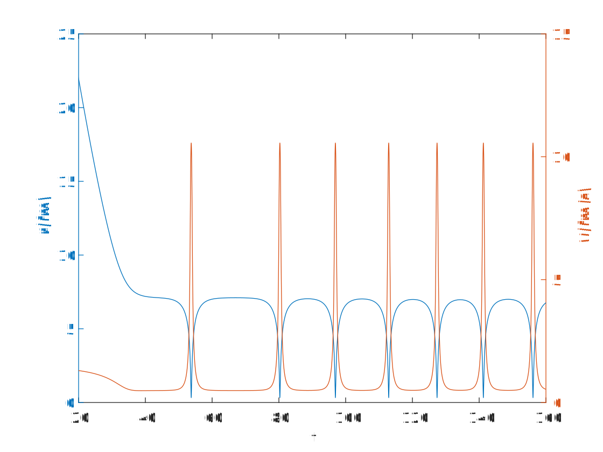
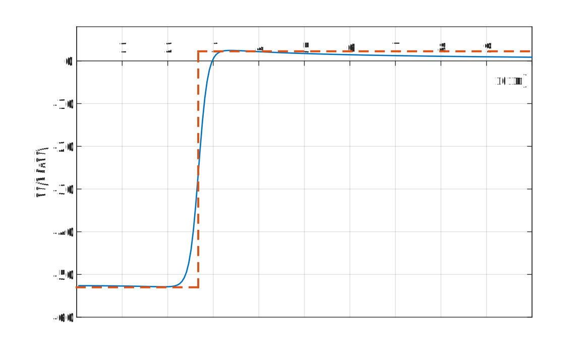
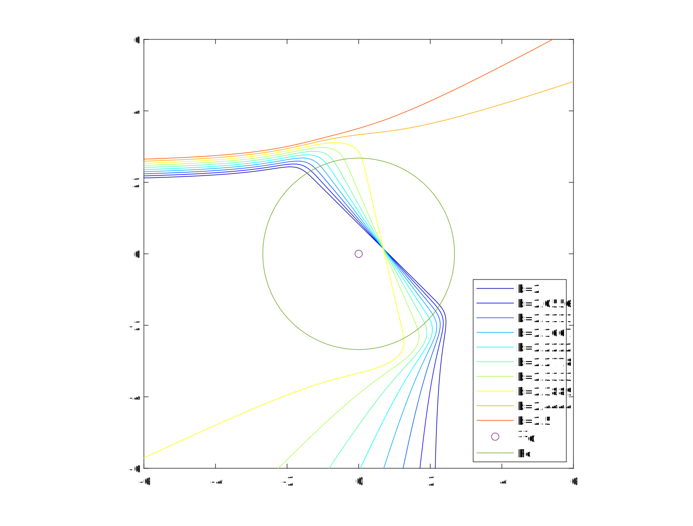
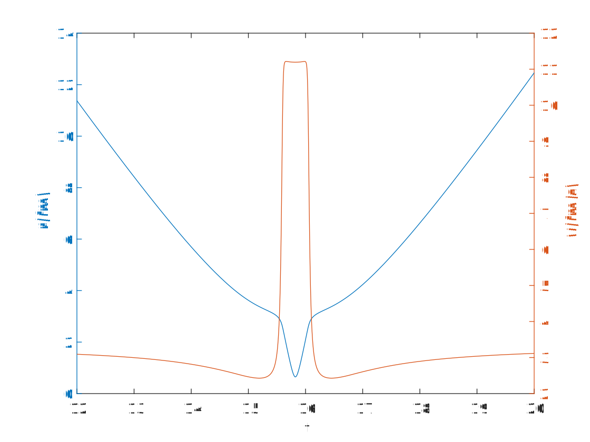

# Woods-Saxon势下的库伦散射

## 势的变化

随着r的减小先增大再减小，即先被排斥后被吸引。且在$^{12}C$核半径范围$R$内吸引的核力远大于排斥的库仑力。
核力：$V=-\cfrac{V_0}{1+\text{exp}(\frac{r-R}{a})}，V_0=56\text{MeV},R=2.68\text{fm},a=0.75\mathrm{fm}$

## 散射图像

对于质子$p$与$^{12}C$碰撞，碰撞参数$b$在$[2.34,2.35]$区间内入射，散射图像如图所示。$(E_0=1\text{MeV})$

对于发生共振的情况$(b=2.3475\text{fm})$绘制质子$p$与$^{12}C$核的距离$r$及其速度$v$随时间的变化，可以发现较为规律的振荡如图：

## 关于折射的联想

Woods-Saxon势随着核的“表面厚度”$a$变小而更加陡峭，选取$a=0.1\text{fm}$，总势的变化如图。可将其近似为只在$R$处发生突变的函数。

在这种近似下，我们认为入射质子$p$的运动状态只在$^{12}C$核的界面处发生突变，即类似于“折射”的概念。尝试画出散射图像为：$(E_0=5\text{MeV})$

选取$b=2.2\text{fm}$的情况绘制质子$p$与$^{12}C$核的距离$r$及其速度$v$随时间的变化，可以看到与我们的假设有一定程度的吻合：

