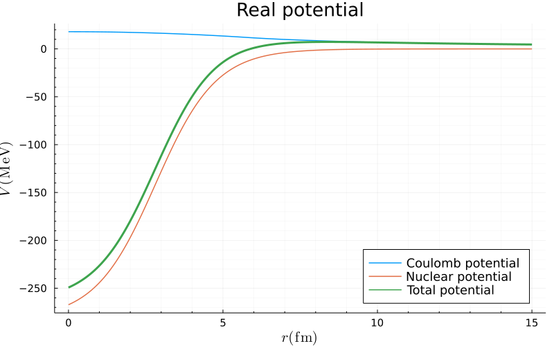
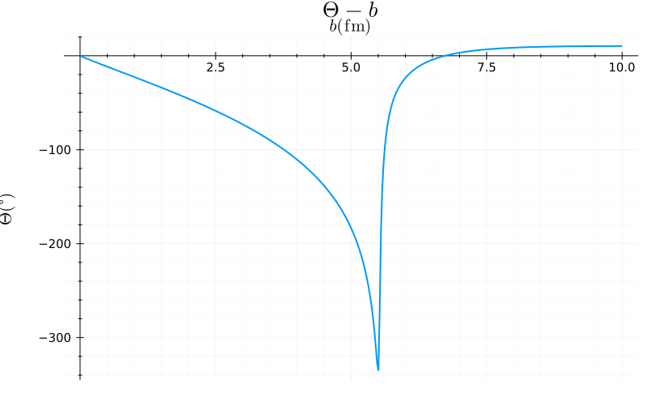
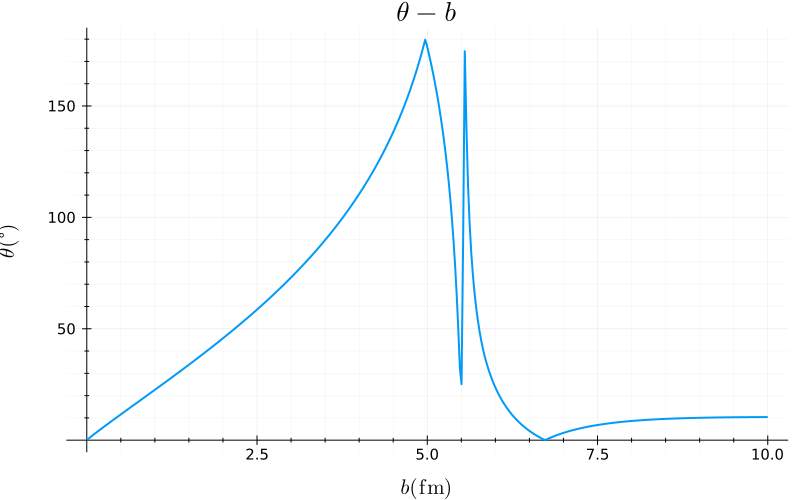
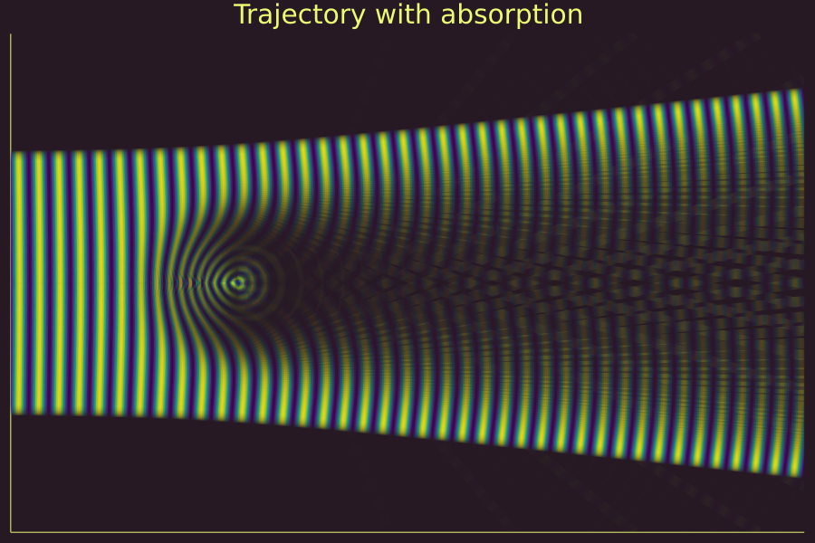
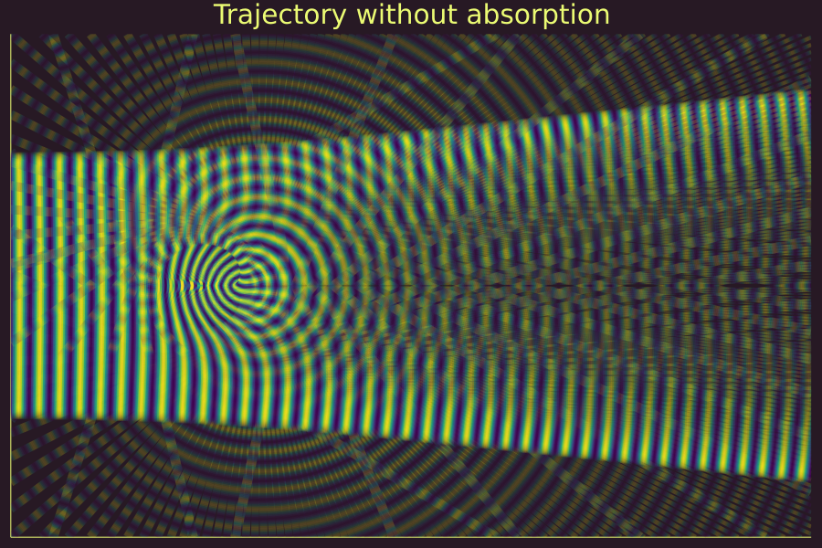

## 相位修正下经典模型

#### 加入吸收势

库伦势：
$$
V_C=\left\{\begin{matrix}
\cfrac{k}{r}, & r\ge R_C\\
\cfrac{k(3-r^2/R_C^2)}{2R_C}, & r<R_C
\end{matrix}\right.
$$
其中$k=Z_pZ_te^2/4\pi\epsilon,~R_C=1.2(M_p^{1/3}+M_t^{1/3})$。

对于复光学势使用六个参数的Woods-Saxon形式：
$$
V_N=-\cfrac{V}{1+\exp(\frac{r-R_V}{a_V})}-i\cfrac{W}{1+\exp(\frac{r-R_W}{a_W})}
$$

其中$R_{V,W}=r_{V,W}(M_p^{1/3}+M_t^{1/3})$。

使用的势参数为：[^Ogloblin]

| $E_\text{lab}(\mathrm{MeV})$ | $V(\mathrm{MeV})$ | $r_V(\mathrm{fm})$ | $a_V(\mathrm{fm})$ | $W(\mathrm{MeV})$ | $r_W(\mathrm{fm})$ | $a_W(\mathrm{fm})$ |
| ---------------------------- | ----------------- | ------------------ | ------------------ | ----------------- | ------------------ | ------------------ |
| 132                          | 282.2             | 0.586              | 0.978              | 13.86             | 1.183              | 0.656              |

绘制库伦势，核势及总中心势的实部图像为：

#### 初始粒子分布

由于我们这里只考虑球对称的势，故只需求解过靶核的二维平面上的运动即可得到散射结果。

设入射粒子流的宽度为$b_0$，共取$n$个碰撞参数递增的粒子，$b_i(\mathrm{fm})$为第$i$个粒子的碰撞参数，$\Delta	b_i$为第$i$个粒子与第$(i-1)$个粒子间的距离。

在碰撞参数较小的情况下，粒子主要受变化陡峭且具有吸收的的核势的作用，运动过程较为复杂。并且我们更关心此区域内不同于库伦散射的散射角变化，希望能够细致刻画运动细节。故而选取粒子的分布为：
$$
\Delta b \propto \mathcal N(\mu=b_0,\sigma=b_0/2)
$$
入射束流要求截面上粒子均匀分布，故每个粒子的权重应为：
$$
w_{i0} \propto b_i \cdot \Delta b_i\quad(i=1,2,\cdots,n)
$$

#### 运动方程

选取质心系为参考系，入射粒子的实验室能量$E_{\mathrm{lab}}$与质量$M_\mathrm{p}$相应转换为质心系能量$E_{\mathrm{cm}}$与折合质量$\mu$。得到初始速度$v_0=\sqrt{2E_{\mathrm{cm}}/\mu}$。

在以靶核为原点，入射方向为极轴的极坐标下求解。
$$
L=T-V =\frac12 \mu\left[\dot r^2+(r\dot\theta)^2\right]-V(r)
$$
由拉格朗日方程：
$$
\begin{cases}
\cfrac{\mathrm d}{\mathrm dt}\cfrac{\partial L}{\partial \dot r}=\cfrac{\partial L}{\partial r}\\
\cfrac{\mathrm d}{\mathrm dt}\cfrac{\partial L}{\partial \dot \theta}=\cfrac{\partial L}{\partial \theta}
\end{cases}
$$
解得：
$$
\begin{cases}
\ddot r = \dot\theta^2r-\cfrac{1}{\mu}\cfrac{\mathrm{d} V}{\mathrm d r}\\
\ddot \theta = -\cfrac{2\dot r\dot\theta}{r}
\end{cases}
$$
可使用常微分方程库求解。注意在求解运动轨迹时$V(r)$项只选取总中心势的实部。

为粒子的运动增加相位因子修正项$\phi$：
$$
\mathrm{d}\phi = k\mathrm{d}s,\quad(k=\cfrac{\sqrt{2m(E-V)}}{\hbar})
$$
$k$为波矢，$s$为路径长度。注意在程序中复数开根默认选取虚部系数为正，故而在绘图体现吸收强度时要取共轭。

在计算散射截面$\sigma(\theta)$时，我们将粒子的最终权重写为：
$$
\omega_i=\omega_{i0}\cdot\mathrm{Re}\left( e^{i\phi} \right)
$$

#### 结果展示

绘制散射偏转角$\Theta$与碰撞参数$b$的关系如图所示：

由于三维下粒子束流关于入射方向轴对称，故接收器得到的散射角$\theta$在$0\degree-180\degree$范围内。将偏转角相应转化为散射角得到$\theta-b$图像：

可以发现，碰撞参数不同的粒子也可能被散射到同一角度。也就是说，这个散射角下的束流强度由多个粒子贡献，且这些粒子各自的强度不同，即叠加发生了干涉。

选取$b_0 = 10\mathrm{fm}$的束流，通过颜色表征粒子的“相位”变化，透明度表征粒子的“幅值”变化。对称绘制截面为：

可以发现在靶核周围，粒子流发生了强烈的变化。首先是出现了较暗的尾部，说明粒子被较强烈地吸收了。其次是等相位面发生了弯曲，以及不同粒子径迹发生了干涉，这说明我们增加的相位因子在一定程度上体现了量子散射的一些特征。但绘图时只是将轨迹进行颜色叠加，无法体现干涉相长和相消，此处需要进一步修改。

再和无吸收部的势散射轨迹进行对比。由于靠近靶核时也不会被吸收，碰撞参数较小的区域出现了明显的大角度散射，轨迹分析可参见上述经典模型。等相位面弯曲与粒子径迹干涉依然存在，并且大角度散射的粒子甚至与入射粒子发生了干涉，形成了奇妙的图样。

#### 总结与反思

我们基于对经典散射和量子散射过程的认知，以及对前人工作的研究，尝试建立了相位修正下的经典模型。虽然在一定程度上体现了量子散射的一些特征，但仍然存在很多问题。

1. 入射粒子分布及权重设置的科学性？（看文献学习改进）
2. 如何解释相位修正的合理行？（进一步研究思考）
3. 绘图时只是将轨迹进行颜色叠加，无法真正体现干涉相长和相消。 （太难了，不一定能做）
4. 通过加入相位因子，展现了波函数的干涉性质；但无法走出粒子的局限性，不能展现波函数的衍射性质。
5. 尚未统计散射截面。（学习回调函数，添加轨迹终点判断，添加多线程，增大数据量）

#### 参考文献

[^Ogloblin]: Ogloblin, A., Glukhov, Y., Trzaska, W., Dem'yanova, A., Goncharov, S., Julin, R., Klebnikov, S., Mutterer, M., Rozhkov, M., Rudakov, V., Tiorin, G., Khoa, D., & Satchler, G. (2000). New measurement of the refractive, elastic $^{16}\mathrm O+~^{12}\mathrm C$ scattering at 132, 170, 200, 230, and 260 MeV incident energies. *Phys. Rev. C, 62, 044601*.
